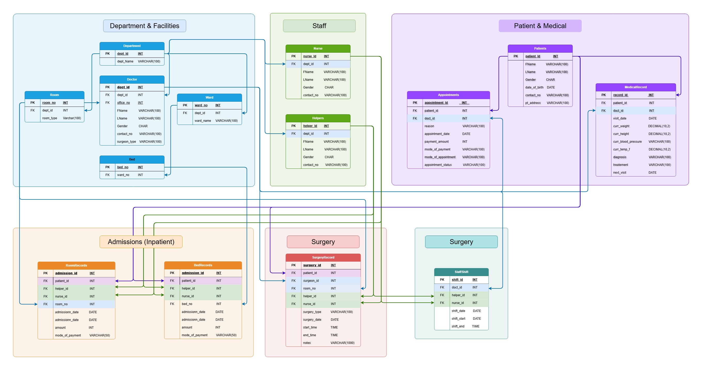

# 🏥 Hospital Management System SQL Project

<p align="center">
  
</p>

## About the Project

Hospitals handle a lot of information every day patients, doctors, appointments, medical records, admissions, rooms, beds, surgeries, and staff.

I built this **Hospital Management System** in MySQL to organize these different areas into one connected relational database and use SQL to retrieve useful information from it.

The project contains **14 interconnected tables, 93 columns, and 15,981 records**, covering different parts of hospital operations.

---

## 📌 What's Inside

The database includes information related to:

- 👤 Patients
- 👨‍⚕️ Doctors
- 👩‍⚕️ Nurses
- 👥 Helpers
- 🏥 Departments
- 🛏️ Wards & Beds
- 🚪 Rooms
- 📅 Appointments
- 📋 Medical Records
- 🏨 Bed Admissions
- 🏨 Room Admissions
- 🩺 Surgeries
- ⏰ Staff Shifts

---

## 🔎 SQL Analysis

After building the database, I wrote SQL queries to work with different parts of the hospital system.

Some of the questions explored:

- Patients and their appointments
- Doctors connected with patients
- Nurses responsible for admissions
- Doctors in each department
- Patients with both appointments and admissions
- Available beds
- Upcoming appointments
- Doctor workload
- Staff working hours
- Patient follow-ups
- Payment methods
- Surgery records and participating staff
- Hospital revenue records

The focus was on using SQL to turn connected database records into clear answers.

---

## 🗂️ Project Structure

```text
Hospital-Management-System-SQL/
│
│
├── analysis/
│   └── hospital_analysis.sql
│
├── database/
│   └── hospital_database.sql
│
├── data/
│   └── hospital_data.xlsx
│
├── report/
│   └── Hospital_Management_System_Report.pdf
│
├── relationship_diagram/
│   └── hospital_relationship_diagram.png
│   
└── README.md

```

---

## 🛠️ Tools Used
* MySQL
* SQL
* Excel
* MySQL Workbench

---

## 📊 Database Overview
| Table         | Records | Purpose              |
| ------------- | ------: | -------------------- |
| Department    |      31 | Hospital departments |
| Room          |     530 | Hospital rooms       |
| Doctor        |     400 | Doctor information   |
| Nurse         |     500 | Nurse information    |
| Helpers       |   1,100 | Helper information   |
| Ward          |      63 | Hospital wards       |
| Bed           |     500 | Hospital beds        |
| Patients      |   1,500 | Patient information  |
| BedRecords    |   1,000 | Bed admissions       |
| RoomRecords   |   1,000 | Room admissions      |
| Appointment   |   1,000 | Patient appointments |
| MedicalRecord |   3,000 | Medical records      |
| StaffShift    |   2,058 | Staff shifts         |
| SurgeryRecord |   1,000 | Surgery information  |


---

📄 Project Report

A complete project report is included in the 'report' folder.

It explains the database structure, relationships, SQL analysis, results, and recommendations.


# 👤 Author

## Muhammad Sarram

📧 muhammadsarramali@gmail.com  
🌐 Portfolio: https://sarram-ali.github.io

💼 Passionate about:

- Database 
- Data Analytics (Python, MYSQL)
- Data Visualization
- Business Intelligence
